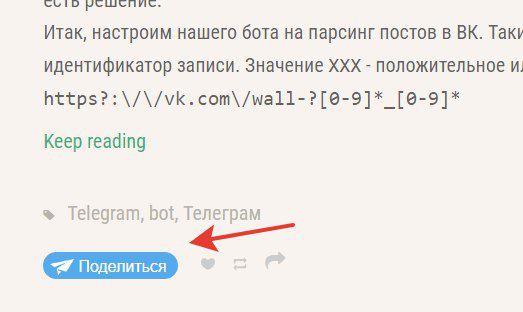

# Share-helper bot for Telegram

На различных веб-сайтах можно встретить кнопку "поделиться в Telegram", позволяющая отправить определённую ссылку в (почти) любой чат в мессенджере. Бот, собранный из приведённых в репозитории исходников, позволяет генерировать ссылку для такой кнопки.



В репозитории вы найдёте два варианта бота; первый, более старый, написан на **Python** сначала при помощи библиотеки [pyTelegramBotAPI](https://github.com/eternnoir/pyTelegramBotAPI), а затем переписан на [aiogram](https://github.com/aiogram/aiogram). Версия для **Golang** использует библиотеку [telebot](https://github.com/tucnak/telebot/).

## Системные требования
**Python**: 3.7 и выше (из-за aiogram)  
**Go**: при разработке использовалась 1.12.5, м.б. запустится на более старых.  
**ОС**: протестировано в Linux (Manjaro), должно работать и на Windows.

## Systemd

Если в вашей операционной системе есть systemd, то можно настроить автозапуск и удобное управление ботом:

```systemd
[Unit]
Description=Share Helper Bot for Telegram
After=network.target

[Service]
Type=simple
WorkingDirectory=/home/user/share-bot

# Для Golang-версии:
Environment=BOT_TOKEN=токен_бота 
ExecStart=/home/user/share-bot/share_bot

# Для Python-версии (используется venv):
# ExecStart=/home/user/share-bot/bin/python /home/user/share-bot/sharebot_aiogram.py

KillMode=process
Restart=always
RestartSec=10

[Install]
WantedBy=multi-user.target
```

Опробовать бота в деле можно по адресу: https://t.me/tgshare_bot